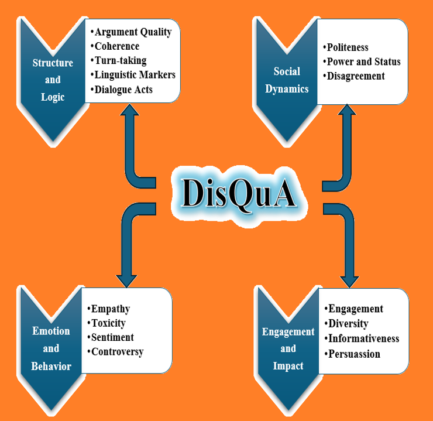

# DisQuA: Discussion Quality Aspects



# Installation
```python
git clone https://github.com/nikos-Gk/dialogue-quality-measures.git
cd dialogue-quality-measures
git fetch --all
git checkout package-list-input
conda create --name discMeasuresEnv python=3.12
conda activate discMeasuresEnv
pip install -e .
python -m spacy download en_core_web_sm
```

# Usage

In the main.py file you can find examples of usage.

# Description of input parameters

-message_list: The list of utterances in the discussion. 

-speakers_list: The corresponding list of speakers for each utterance.

-msgsid_list: List of messages ids corresponding to each utterance.

-replyto_list: List indicating the message ID each utterance is replying to.

-disc_id: A unique identifier for the discussion.

-discussion_level: A boolean flag; if True, the annotations are applied at the discussion level; otherwise at the utterance level.

-ctx: Number of previous utterances to include as context for each input.

-openAIKEY: OpenAI API key, required if using OpenAI-based models.

-model_type: Specifies the model to use; options are "openai" or "llama" .

-model_path:  Path to the local LlaMA model directory, used only if model_type is "llama".

-gpu: A boolean flag; if True, utilizes GPU (when available); otherwise defaults to CPU.

-device: The device to load the model on. If None, the device will be inferred. Defaults to cpu.

# Argument Quality
## calculate_arg_dim: Argument Quality Aspects (Turn-Level)
This module evaluates the quality of argumentation in individual discussion turns using the taxonomy proposed by Wachsmuth et al. (2017). Leveraging either OpenAI's language models or a locally hosted Llama model, it assigns scores across multiple dimensions of argument quality, with each dimension rated on a scale from 1 (low) to 3 (high).

#### Logic Dimensions:
-Label 1a-Local Acceptability: Premises of the argument worthy of being believed.

-Label 1b-Local Relevance: Premises support/attack the conclusion of the argument. 

-Label 1c-Local Sufficiency: Premises enough to draw the conclusion of the argument. 

-Label 1_overall-Cogency: Argument has locally acceptable, relevant, and sufficient premises. 

#### Rhetoric Dimensions:
-Label 2a-Credibility: Argument makes the author worthy of credence. 

-Label 2b-Emotional Appeal: Argument creates emotions that make the audience open to it. 

-Label 2c-Clarity: Argument avoids deviation from the issue, and uses correct and unambiguous language. 

-Label 2d-Appropriateness: Language proportional to the issue, supports credibility and emotions. 

-Label 2e-Arrangement: Discussion topic, arguments and conlusions are presented in the right order. 

-Label 2_overall-Effectiveness: Argument persuades the audience. 

#### Dialectic Dimensions:
-Label 3a-Global Acceptability: Audience accepts the use of the argument. 

-Label 3b-Global Relevance: Argument helps arrive at an agreement. 

-Label 3c-Global Sufficiency: Argument adequately rebuts the anticipated counter-arguments to its conclusion. 

-Label 3_overall-Reasonableness: Argument is (globally) acceptable, relevant, and sufficient.

#### Overall Quality:

-Label 4-overall quality: The holistic quality of the argument across all dimensions.

*Note: Requires access to OpenAI’s language models via API, or a locally hosted Llama model.*

```python
 from DiscQuA import calculate_arg_dim
    arg_dim_scores = calculate_arg_dim(
                                        message_list=message_list,
                                        speakers_list=speakers_list,
                                        disc_id=disc_id,
                                        openAIKEY="your key",
                                        model_type="openai",
                                        model_path="",
                                        gpu=False,
                                        ctx=1,
                                        dimension="logic",
                                      )
    arg_dim_scores = calculate_arg_dim(
                                        message_list=message_list,
                                        speakers_list=speakers_list,
                                        disc_id=disc_id,
                                        openAIKEY="",
                                        model_type="llama",
                                        model_path="/path/to/model/llama-2-13b-chat.Q5_K_M.gguf",
                                        gpu=False,
                                        ctx=1,
                                        dimension="logic",
                                      )

where dimension (str): The argument quality dimension to evaluate. Choose from:
            - "logic": Evaluates the internal structure and reasoning of the argument.
            - "rhetoric": Assesses the persuasive and stylistic elements.
            - "dialectic": Measures how well the argument contributes to discussion and resolution.
            - "overall": Provides a holistic score across all dimensions.

```
## calculate_overall_arg_quality: Overall Argument Quality (Discussion-Level)
This module evaluates the average overall quality of argumentation across the entire discussion. Leveraging either OpenAI’s language models or a locally hosted Llama model, it returns a discussion-level score that reflects the holistic strength of arguments exchanged throughout the discussion.

#### Scoring Modes:

-mode="real": Returns a real-valued score (e.g., 2.7) on a scale from 1 to 5.

-mode="rating": Returns a discrete integer score on a scale from 1 (low) to 3 (high).

*Note: Requires access to OpenAI’s language models via API, or a locally hosted Llama model.*

```python
from DiscQuA import calculate_overall_arg_quality

    overall_argument_quality_score = calculate_overall_arg_quality(
                                                                    message_list=message_list,
                                                                    speakers_list=speakers_list,
                                                                    disc_id=disc_id,
                                                                    openAIKEY="your key",
                                                                    model_type="openai",
                                                                    model_path="",
                                                                    mode="real",
                                                                    gpu=False,
                                                                  )

    overall_argument_quality_score = calculate_overall_arg_quality(
                                                                    message_list=message_list,
                                                                    speakers_list=speakers_list,
                                                                    disc_id=disc_id,
                                                                    openAIKEY="",
                                                                    model_type="llama",
                                                                    model_path="/path/to/model/llama-2-13b-chat.Q5_K_M.gguf",
                                                                    mode="real",
                                                                    gpu=False,
                                                                  )                                                                
```
# Coherence
## calculate_coherence_conversation: Coherence Analysis (Discussion-Level)
This module assesses the overall coherence of a discussion using OpenAI's language models or a locally hosted Llama model (Zhang et al., 2024). It assesses how logically and contextually connected the messages are across the discussion. The model assigns a coherence score to the entire discussion on a 1-to-5 scale, where:

- **1** – Poor coherence (incoherent or disjointed)
- **5** – Strong coherence (well-structured and contextually consistent)

*Note: Requires access to OpenAI’s language models via API, or a locally hosted Llama model.*

```python
from DiscQuA import calculate_coherence_conversation

    coherence_disc_score=calculate_coherence_conversation(
                                                            message_list=message_list,
                                                            speakers_list=speakers_list,
                                                            disc_id=disc_id,
                                                            openAIKEY="you key",
                                                            model_type="openai",
                                                            model_path="",
                                                            gpu=False,
                                                         )

    coherence_disc_score=calculate_coherence_conversation(
                                                            message_list=message_list,
                                                            speakers_list=speakers_list,
                                                            disc_id=disc_id,
                                                            openAIKEY="",
                                                            model_type="llama",
                                                            model_path="/path/to/model/llama-2-13b-chat.Q5_K_M.gguf",
                                                            gpu=True,
                                                         )
```
## calculate_coherence_response: Coherence Analysis (Turn-Level) 
This module evaluates the coherence of individual responses within a discussion. Using OpenAI's language models or a locally hosted Llama model, it examines how well a message aligns with its conversational context. The model assigns a coherence score to each response on a 1-to-5 scale:

- **1** – Incoherent response (off-topic, confusing, or disjointed)
- **5** – Coherent (well-aligned with context, clear, and logically structured)

*Note: Requires access to OpenAI’s language models via API, or a locally hosted Llama model.*

```python
from DiscQuA import calculate_coherence_response

    score = calculate_coherence_response(
                                            message_list=message_list,
                                            speakers_list=speakers_list,
                                            disc_id=disc_id,
                                            openAIKEY="you key",
                                            model_type="openai",
                                            model_path="",
                                            gpu=True,
                                            ctx=1,
                                        )
    score = calculate_coherence_response(
                                            message_list=message_list,
                                            speakers_list=speakers_list,
                                            disc_id=disc_id,
                                            openAIKEY="",
                                            model_type="llama",
                                            model_path="/path/to/model/llama-2-13b-chat.Q5_K_M.gguf",
                                            gpu=True,
                                            ctx=1,
                                        )
```
## calculate_coherence_ecoh: Coherence Analysis (Turn-Level) 

This module evaluates the coherence of individual responses within a discussion. Using a locally hosted model presented at Mendonça, Trancoso and Lavie (2024), it examines how well a comment aligns with its conversational context. The model assigns a binary coherence label to each response, where:

- **0** – Incoherent response (off-topic, confusing, or disjointed)
- **1** – Coherent (well-aligned with context, clear, and logically structured)


```python
from DiscQuA import calculate_coherence_ecoh

    coherence_booleans = calculate_coherence_ecoh(
                                                    message_list=message_list,
                                                    speaker_list=speakers_list,
                                                    disc_id=disc_id,
                                                    device="cuda",
                                                 )
```
# Collaboration
## calculate_collaboration: Collaboration markers (Discussion and Turn Level)
This module annotates a discussion or each comment within the discussion with conversational markers indicative of collaboration, such as expressions of confidence, uncertainty, pronoun usage, and idea adoption, based on Niculae and Danescu-Niculescu-Mizil (2016).

#### Labels:

-n_words: The number of words in an utterance.

-pron_me: The number of first-person singular pronouns.

-pron_we: The number of first-person plural pronouns.

-pron_you: The number of second-person pronouns.

-pron_3rd: The number of third-person pronouns.

-geo: The number of geography-related terms.

-meta: The number of meta-discourse terms. Meta terms are associated with the functionalities, actions, and elements within the StreetCrowd environment

-certain: The number of words expressing certainty.

-hedge: The number of hedging terms (words that indicate uncertainty).

-n_introduced: The number of new content words introduced by a user.

-n_introduced_w_certain: The number of new content words introduced in an utterance that are also accompanied by certainty terms.

-n_introduced_w_hedge: The number of new content words introduced in an utterance that are also accompanied by hedging terms.

```python
from DiscQuA import calculate_collaboration

    collaboration_scores = calculate_collaboration(
                                                    collaboration_scores = calculate_collaboration(
                                                    message_list=message_list,
                                                    speakers_list=speakers_list,
                                                    disc_id=disc_id,
                                                    discussion_level=True,
                                                  )
```
# Controversy
## calculate_controversy: Controversy Analysis (Discussion and Turn Level)
This module quantifies the level of controversy in a discussion by analyzing the standard deviation of sentiment scores assigned to individual comments (Avalle et al., 2024). Sentiment scores are derived using a pretrained BERT model.

#### Outputs:

-controversy_per_disc_unorm (discussion_level=True): Sample standard deviation of the unnormalized sentiment scores across all comments in the discussion.

-controversy_per_disc_norm (discussion_level=True): Sample standard deviation of the normalized sentiment scores across the discussion.

-controversy_per_utt_unorm (discussion_level=False): Rolling standard deviation of the unnormalized sentiment scores.

-controversy_per_utt_norm (discussion_level=False): Rolling standard deviation of the normalized sentiment scores.


```python
from DiscQuA import calculate_controversy

    unorm_scores, norm_scores = calculate_controversy(
                                                        message_list=message_list, 
                                                        disc_id=disc_id, 
                                                        discussion_level=True
                                                     )
```

# Dispute Tactics
## calculate_dispute_tactics: Disagreement Levels and Coordination Labels Analysis (Turn-Level).
This module analyzes utterances in a discussion to identify levels of disagreement and markers of coordination, based on the annotation framework introduced by De Kock and Vlachos (2022). Leveraging either OpenAI’s language models or a locally hosted Llama model, each utterance is assigned a binary label (1 or 0) to indicate the presence or absence of a specific disagreement level or coordination label.
#### Disagreement levels:

-Level 0-Name calling/hostility: Comment with direct insults, or use of an equally hostile tone or language. 

-Level 1-Ad hominem/ad argument: Comment that attacks other users to discredit them or their arguments without addressing the content. 

-Level 2-Attempted derailing/off-topic: Comment that is unrelated to the current line of discussion.

-Level 3-Policing the discussion: Comment that does not address (opposing) arguments’ content but mainly try to "policy" the discussion (e.g., telling people to "calm down").

-Level 4a-Stating your stance: Comment that states an opposing view (stance), with little or no supporting evidence.

-Level 4b-Repeated argument: Comment that re-states a previously expressed argument, potentially using different words, but without furthering the discussion.

-Level 5-Counterargument: Comment that states an opposing view (stance), while providing supporting reasoning and/or evidence.

-Level 6-Refutation: Comment that responds to an argument and explains why it is mistaken, using new evidence or reasoning.

-Level 7-Refuting the central point: Comment that directly refutes the central point of an argument, explaining why it is mistaken, using new evidence or reasoning.

### Coordination labels (attempts to promote understanding and consensus):

-Label A-Bailing out: An indication that a person is giving up on a discussion and will no longer engage.

-Label B-Contextualisation: Usually in the first utterance, an individual “sets the stage" by describing what aspect they are 
challenging.

-Label C-Asking questions: Seeking to understand another person’s opinion better. This does not include rhetorical questions, which are generally disagreement moves.

-Label D-Providing clarification: Answering questions or providing information which seeks to create understanding, rather than only furthering a point.

-Label E-Suggesting a compromise: An attempt to find a midway between one’s own point and the opposer’s.

-Label F-Coordinating: In disagreement threads, discussions about edits that may indicate a compromise.

-Label G-Conceding/recanting: An explicit admission that an interlocutor is willing to relinquish their point.

-Label H-I don't know: Admitting that one is uncertain-a signal that the speaker is receptive to the idea that there are unknowns which may impact their argument.

-Label I-Other: For utterances not covered by any other class, for instance, social niceties. 

*Note: Requires access to OpenAI’s language models via API, or a locally hosted Llama model.*


```python
from DiscQuA import calculate_dispute_tactics

    disp_tact = calculate_dispute_tactics(
                                            message_list=message_list,
                                            speakers_list=speakers_list,
                                            disc_id=disc_id,
                                            openAIKEY="your key",
                                            model_type="openai",
                                            model_path="",
                                            gpu=False,
                                            ctx=1,
                                         )
    disp_tact = calculate_dispute_tactics(
                                            message_list=message_list,
                                            speakers_list=speakers_list,
                                            disc_id=disc_id,
                                            openAIKEY="",
                                            model_type="llama",
                                            model_path="/path/to/model/llama-2-13b-chat.Q5_K_M.gguf",
                                            gpu=False,
                                            ctx=1,
                                         )
```
# Diversity
## calculate_diversity_conversation: Diversity Analysis (Discussion-Level)
This module assesses the diversity of arguments within a discussion using OpenAI's language models or a locally hosted Llama model(Zhang et al., 2024). Diversity in arguments reflects the presence of multiple perspectives, contributing to a richer and more balanced exchange. The model assigns a diversity score to the entire discussion on a 1-to-5 scale, where:

- **1** – Poor diversity (high similarity or repetition in arguments)
- **5** – High diversity (broad range of perspectives and reasoning styles)

*Note: Requires access to OpenAI’s language models via API, or a locally hosted Llama model.*

```python
from DiscQuA import calculate_diversity_conversation


    diversity_disc_score = calculate_diversity_conversation(
                                                            message_list=message_list,
                                                            speakers_list=speakers_list,
                                                            disc_id=disc_id,
                                                            openAIKEY="your key",
                                                            model_type="openai",
                                                            model_path="",
                                                            gpu=False,
                                                           )

    diversity_disc_score = calculate_diversity_conversation(
                                                            message_list=message_list,
                                                            speakers_list=speakers_list,
                                                            disc_id=disc_id,
                                                            openAIKEY="",
                                                            model_type="llama",
                                                            model_path="/path/to/model/llama-2-13b-chat.Q5_K_M.gguf",
                                                            gpu=True,
                                                           )
```
## calculate_diversity_response: Diversity Analysis (Turn-Level)
This module computes diversity scores for each response within a discussion using OpenAI's language models or a locally hosted Llama model. The model assigns a diversity score to each response on a 1-to-5 scale, where:

- **1** – Poor diversity (high similarity or repetition in arguments)
- **5** – High diversity (broad range of perspectives and reasoning styles)

*Note: Requires access to OpenAI’s language models via API, or a locally hosted Llama model.*

```python
from DiscQuA import calculate_diversity_response

    diversity_resp_score = calculate_diversity_response(
                                                        message_list=message_list,
                                                        speakers_list=speakers_list,
                                                        disc_id=disc_id,
                                                        openAIKEY="your key",
                                                        model_type="openai",
                                                        model_path="",
                                                        gpu=False,
                                                        ctx=1,
                                                       )
    diversity_resp_score = calculate_diversity_response(
                                                        message_list=message_list,
                                                        speakers_list=speakers_list,
                                                        disc_id=disc_id,
                                                        openAIKEY="",
                                                        model_type="llama",
                                                        model_path="/path/to/model/llama-2-13b-chat.Q5_K_M.gguf",
                                                        gpu=True,
                                                        ctx=1,
                                                       )
```
# Empathy
## calculate_dialogicity: Dialogicity (potential other-orientedness) & Empathy Analysis (Turn–Level)
This module analyzes utterances in a discussion to identify dialogical functions that reflect empathy and support the construction of common ground, following the framework presented by Macagno et al. (2022). Leveraging either OpenAI’s language models or a locally hosted Llama model, each utterance is assigned a binary label (1 or 0) indicating the presence or absence of a specific dialogical function.
#### Labels:

-Label 0: Stating – Presents information, viewpoints, or value judgments without justification.

-Label 1: Accepting/Discarding – Acknowledges, accepts, or rejects another's opinion without further reasoning or clarification.

-Label 2: Managerial– Coordinates the discussion process (e.g., managing turn-taking or procedural contributions).

-Label 3a: Expanding/Low Relevance – Elaborates or clarifies one’s own position without referring to previous utterances.

-Label 3b: Expanding/High Relevance – Builds upon or engages with a previous utterance to clarify or deepen understanding.

-Label 4a: Metadialogical/Low Relevance – Addresses linguistic or procedural aspects unrelated to the previous utterance.

-Label 4b: Metadialogical/High Relevance – Reflects on previous comments to clarify meaning, question assumptions, or link discourse to goals.

-Label 5: Reasoning – Provides arguments, justifications, comparisons, or evidence to support or challenge a point.

-Label 6: Metadialogical Reasoning – Combines critical reasoning with meta-level reflection (e.g., challenging the language or assumptions behind arguments).

-Label 7a: Inviting/Low Relevance – Encourages others to contribute without directly referencing previous statements.

-Label 7b: Inviting/High Relevance – Prompts others to explain or justify a specific previous utterance.

-Label 8: Other – For utterances that do not fit any of the above categories.

*Note: Requires access to OpenAI’s language models via API, or a locally hosted Llama model.*

```python
from DiscQuA import dialogicity

    dialogicity_labels = dialogicity(
                                        message_list=message_list,
                                        speakers_list=speakers_list,
                                        disc_id=disc_id,
                                        openAIKEY="your key",
                                        model_type="openai",
                                        model_path="",
                                        gpu=True,
                                        ctx=1,
                                    )
    dialogicity_labels = dialogicity(
                                        message_list=message_list,
                                        speakers_list=speakers_list,
                                        disc_id=disc_id,
                                        openAIKEY="",
                                        model_type="llama",
                                        model_path="/path/to/model/llama-2-13b-chat.Q5_K_M.gguf",
                                        gpu=True,
                                        ctx=1,
                                    )
```
# Engagement
## calculate_engagement_conversation: Engagement Analysis (Discussion–Level)
This module assesses the level of engagement within a discussion using OpenAI's language models or a locally hosted Llama model (Zhang et al., 2024). Engagement captures how actively participants contribute and how sustained the interaction is across the discussion. The model assigns an engagement score to the entire discussion on a 1-to-5 scale, where:

- **1** – Law engagement (limited interaction, short or shallow exchanges)
- **5** – High engagement (frequent, sustained, and reciprocal participation)

*Note: Requires access to OpenAI’s language models via API, or a locally hosted Llama model.*

```python
from DiscQuA import calculate_engagement_conversation

    engagement_disc_score = calculate_engagement_conversation(
                                                                message_list=message_list,
                                                                speakers_list=speakers_list,
                                                                disc_id=disc_id,
                                                                openAIKEY="your key",
                                                                model_type="openai",
                                                                model_path="",
                                                                gpu=False,
                                                             )
    engagement_disc_score = calculate_engagement_conversation(
                                                                message_list=message_list,
                                                                speakers_list=speakers_list,
                                                                disc_id=disc_id,
                                                                openAIKEY="",
                                                                model_type="llama",
                                                                model_path="/path/to/model/llama-2-13b-chat.Q5_K_M.gguf",
                                                                gpu=True,
                                                             )
```
## calculate_engagement_response: Engagement Analysis (Turn–Level)
This module assigns engagement scores for each response in a discussion using OpenAI's language models or a locally hosted Llama model. Each response is evaluated in context for its engagement quality based on characteristics of variety of response according to the context, likelihood of encouraging the other participant to respond, likelihood of encouraging a quality response from the other participants, interestingness, specificity, and likelihood of creating a sense of belonging for the other participants (Ferron et al., 2023).  The model assigns an engagement score to each response on a continuous scale from 0 to 100, where:
- **0** – disengaging.
- **100** – very engaging.

*Note: Requires access to OpenAI’s language models via API, or a locally hosted Llama model.*

```python
from DiscQuA import calculate_engagement_response

     engagement_resp_score = calculate_engagement_response(
                                                            message_list=message_list,
                                                            speakers_list=speakers_list,
                                                            disc_id=disc_id,
                                                            openAIKEY="your key",
                                                            model_type="openai",
                                                            model_path="",
                                                            gpu=False,
                                                            ctx=1,
                                                          )
                                                            
     engagement_resp_score = calculate_engagement_response(
                                                            message_list=message_list,
                                                            speakers_list=speakers_list,
                                                            disc_id=disc_id,
                                                            openAIKEY="",
                                                            model_type="llama",
                                                            model_path="/path/to/model/llama-2-13b-chat.Q5_K_M.gguf",
                                                            gpu=False,
                                                            ctx=1,
                                                         )
```
# Informativeness
## calculate_informativeness_conversation: Informativeness Analysis (Discussion-Level)

This module evaluates the informativeness of a discussion using OpenAI's language models or a locally hosted Llama model (Zhang et al., 2024). It estimates how much relevant, useful, and novel information is conveyed by the participants throughout the discussion. The model assigns an informativeness score to the entire discussion on a 1-to-5 scale, where:

- **1** – Low informativeness (vague, repetitive, or off-topic discussion)
- **5** – High informativeness (substantive, relevant, and information-rich discussion)

*Note: Requires access to OpenAI’s language models via API, or a locally hosted Llama model.*

```python
from DiscQuA import calculate_informativeness_conversation

    informativeness_disc_score = calculate_informativeness_conversation(
                                                                        message_list=message_list,
                                                                        speakers_list=speakers_list,
                                                                        disc_id=disc_id,
                                                                        openAIKEY="your key",
                                                                        model_type="openai",
                                                                        model_path="",
                                                                        gpu=False,
                                                                       )
    informativeness_disc_score = calculate_informativeness_conversation(
                                                                        message_list=message_list,
                                                                        speakers_list=speakers_list,
                                                                        disc_id=disc_id,
                                                                        openAIKEY="",
                                                                        model_type="llama",
                                                                        model_path="/path/to/model/llama-2-13b-chat.Q5_K_M.gguf",
                                                                        gpu=True,
                                                                       )
```
## calculate_informativeness_response: Informativeness Analysis (Turn-Level)

This module evaluates the informativeness of individual responses within a discussion. Using OpenAI's language models or a locally hosted Llama model, it assigns an informativeness score to each response on a 1-to-5 scale:

- **1** – Low informativeness (vague, repetitive, or off-topic discussion)
- **5** – High informativeness (substantive, relevant, and information-rich discussion)

*Note: Requires access to OpenAI’s language models via API, or a locally hosted Llama model.*

```python
from DiscQuA import calculate_informativeness_response

    informativeness_resp_score = calculate_informativeness_response(
                                                                    message_list=message_list,
                                                                    speakers_list=speakers_list,
                                                                    disc_id=disc_id,
                                                                    openAIKEY="your key",
                                                                    model_type="openai",
                                                                    model_path="",
                                                                    gpu=False,
                                                                    ctx=1,
                                                                   )
    informativeness_resp_score = calculate_informativeness_response(
                                                                    message_list=message_list,
                                                                    speakers_list=speakers_list,
                                                                    disc_id=disc_id,
                                                                    openAIKEY="",
                                                                    model_type="llama",
                                                                    model_path="/path/to/model/llama-2-13b-chat.Q5_K_M.gguf",
                                                                    gpu=False,
                                                                    ctx=1,
                                                                   )
```
# Language Features 
## calculate_language_features: Linguistic features based on word overlap (Turn-level).
This module analyzes linguistic features by measuring word overlap between consecutive messages within a discussion (Tan et al., 2016). It focuses on:

-common words (comwords),

-stopwords,

-content words (contwords).

### Labels: Let utt_i, and utt_i+1 two consecutive utterances in the discussion. 
-n_comwords, n_stopwords, n_contwords: Count of overlapping words between utt_i and utt_i+1 (i.e., |utt_i ∩ utt_i+1|).

-reply_fra_comwords, reply_fra_stopwords, reply_fra_contwords: Proportion of overlapping words relative to the reply (i.e., |utt_i ∩ utt_i+1|/|utt_i+1|).

-op_fra_comwords, op_fra_stopwords, op_fra_contwords: Proportion of overlapping words relative to the original message (i.e., |utt_i ∩ utt_i+1|/|utt_i|).

-jac_comwords, jac_stopwords, jac_contwords: Jaccard similarity between the two utterances (i.e., |utt_i ∩ utt_i+1|/|utt_i ∪ utt_i+1|). 


```python
from DiscQuA import calculate_language_features

    language_fetures_scores=calculate_language_features(
                                                        message_list=message_list,
                                                        disc_id=disc_id,
                                                       )
```
# Persuasiveness 

## calculate_persuasiveness: Persuasiveness Analysis (Discussion-Level)

This module assesses the persuasiveness of arguments exchanged within a discussion using OpenAI's language models or a locally hosted Llama model.The model evaluates the extent to which the arguments are convincing, well-supported, and logically compelling. This reflects the rhetorical strength of the discussion and how effectively participants attempt to sway one another. The model assigns a persuasiveness score to the entire discussion on a 1-to-5 scale, where:

- **1** – Low persuasiveness.
- **5** – High persuasiveness.

*Note: Requires access to OpenAI’s language models via API, or a locally hosted Llama model.*

```python
from DiscQuA import calculate_persuasiveness

    persuasiveness_score = calculate_persuasiveness(
                                                    message_list=message_list,
                                                    speakers_list=speakers_list,
                                                    disc_id=disc_id,
                                                    openAIKEY="your key",
                                                    model_type="openai",
                                                    model_path="",
                                                    gpu=False,
                                                   )

    persuasiveness_score = calculate_persuasiveness(
                                                    message_list=message_list,
                                                    speakers_list=speakers_list,
                                                    disc_id=disc_id,
                                                    openAIKEY="",
                                                    model_type="llama",
                                                    model_path="/path/to/model/llama-2-13b-chat.Q5_K_M.gguf",
                                                    gpu=True,
                                                   )
```
# Politeness
## calculate_politeness: Politeness markers (Discussion and Turn Level)
This module annotates a discussion or each comment within the discussion with politeness markers, based on the framework presented by Danescu-Niculescu-Mizil et al. (2013).

#### Labels:

-Please: The presence of the word ‘please’ in the sentence (e.g., Could you please say more. . .).

-Start with ‘Please’: The sentence starts with the word ‘please’ (e.g., Please do not remove warnings . . .).

-Has subject hedge: Any subject in the sentence depends on a hedge word (e.g., I suggest we start with . . .).

-Use of ‘by the way’: The phrase ‘by the way’ is used in the sentence (e.g., By the way, where did you find . . .).

-Hedge words: Any word in the sentence is a hedge word.

-Assert factuality: Words that assert factuality, like ‘in fact,’ ‘actually,’ or ‘really’ (e.g., In fact you did link).

-Start with deference: The sentence starts with deferential words like ‘great,’ ‘good,’ or ‘nice’ (e.g., Nice work so far on your rewrite).

-Gratitude: Expressions of gratitude, like ‘thank’ or ‘thanks’ (e.g., I really appreciate that you’ve done them).

-Apologising: Apologetic expressions like ‘sorry,’ or ‘I apologize’ (e.g.,  Sorry to bother you . . .).

-1st person plural: First-person plural pronouns (e.g., Could we find a less complex name . . .).

-1st person pronouns: First-person singular pronouns (e.g., It is my view that ...).

-Start with 1st person: The sentence starts with a first-person singular pronoun (e.g.,  I have just put the article . . .).

-2nd person pronouns: Second-person pronouns like (e.g.,  But what’s the good source you have in mind?).

-Start with 2nd person:  The sentence starts with a second-person pronoun (e.g., You’ve reverted yourself . . .).

-Start with greeting: The sentence starts with a greeting word (e.g., Hey, I just tried to . . .).

-Starts with question: The sentence starts with a question word like ‘what,’ ‘why,’ ‘who,’ or ‘how’ (What is your native language?).

-Starts with conjunction: The sentence starts with a conjunction or transition word like ‘so,’ ‘then,’ ‘and,’ ‘but,’ or ‘or’ (e.g., So can you retrieve it or not?).

-Positive sentiment words: The presence of positive sentiment words (e.g.,  Wow! / This is a great way to deal. . .).

-Negative sentiment words: The presence of negative sentiment words (e.g., If you’re going to accuse me . . .).

-Subjunctive words: The use of subjunctive mood words like ‘could’ or ‘would’ when preceded by ‘you’ (e.g., Could/Would you . . .).

-Indicative words: The use of indicative mood words like ‘can’ or ‘will’ when preceded by ‘you’ (e.g., Can/Will you . . .).

```python
from DiscQuA import 

    politeness_features_scores = calculate_politeness(
                                                        message_list=message_list,
                                                        speakers_list=speakers_list,
                                                        disc_id=disc_id,
                                                        discussion_level=True,
                                                     )
```
# Power, Status and Social Bias
## calculate_coordination_per_disc_utt: Linguistic Style Coordination (Discussion and Turn Level)
This module computes linguistic coordination metrics either at the discussion or at the utterance level. For each participant in a discussion, analyzes the extent to which they mirror the linguistic style of those they are responding to, as well as how much others, replying to them, imitate their linguistic style (Danescu-Niculescu-Mizil et al., 2012).

-Linguistic Style: articles, auxiliary verbs, conjunctions, adverbs, personal pronouns, impersonal pronouns, prepositions, quantifiers.
#### Labels:
-coord_allspeakers_2_user: Coordination from all speakers toward each user.

-coord_user_2_allspeaker: Coordination from each user toward all other speakers.

-agg1: aggegate measure that does not use smoothing assumptions.

-agg2: aggegate measure that does use smoothing assumptions.

-agg3: aggegate measure that does use (different) smoothing assumptions.

```python
from DiscQuA import calculate_coordination_per_disc_utt

    coordination_scores = calculate_coordination_per_disc_utt(
                                                                message_list=message_list,
                                                                speakers_list=speakers_list,
                                                                msgsid_list=msgsid_list,
                                                                replyto_list=replyto_list,
                                                                disc_id=disc_id,
                                                                discussion_level=True,
                                                             )
```

## calculate_social_bias: Social Bias Analysis (Turn-Level)
This module analyzes utterances in a discussion to identify instances where individuals project social biases and stereotypes onto others, based on pragmatic frames introduced by Sap et al. (2020). Leveraging either OpenAI’s language models or a locally hosted Llama model, each utterance is assigned a binary label (1 or 0) that indicates the presence or absence of a specific type of social bias.

#### Labels:

-Label 0-Offensiveness: Comment is considered offensive, disrespectful, or toxic to anyone/someone.

-Label 1-Intent to offend: The intent of the comment is to be offensive/disrespectful to anyone.

-Label 2-Lewd: The comment contains or alludes to sexual content/acts.

-Label 3-Group implications:The comment implies offense/disrespect towards an identity-related group (e.g., Muslims).

-Label 4-In group language: The comment targets an identity-related group and the author appears to be part of that demographic group.

-Label 5: Other - For comments not covered by the above labels.

*Note: Requires access to OpenAI’s language models via API, or a locally hosted Llama model.*

```python
from DiscQuA import calculate_social_bias
    social_bias_labels = calculate_social_bias(
                                                message_list=message_list,
                                                speakers_list=speakers_list,
                                                disc_id=disc_id,
                                                openAIKEY="your key",
                                                model_type="openai",
                                                model_path="",
                                                gpu=False,
                                                ctx=1,
                                              )

    social_bias_labels = calculate_social_bias(
                                                message_list=message_list,
                                                speakers_list=speakers_list,
                                                disc_id=disc_id,
                                                openAIKEY="",
                                                model_type="llama",
                                                model_path="/path/to/model/llama-2-13b-chat.Q5_K_M.gguf",
                                                gpu=False,
                                                ctx=1,
                                              )
```
# Readability
## calculate_readability: Readability Analysis (Turn-Level)
This module evaluates each utterance in a discussion using four standard readability metrics (Flesch, 1948; Gunning, 1952; Mc Laughlin, 1969; Kincaid, 1975). These measures help assess the complexity of language used at the turn level.

#### Labels:
-Gunning_Fog: Gunning Fog Index-higher values indicate less readable text.

-Smog: SMOG index-higher values indicate less readable text.

-Flesch: The Flesch Reading Ease score-higher values indicate more readable text.

-Flesch_Kincaid: Flesch-Kincaid index-higher values indicate less readable text.


```python
from DiscQuA import calculate_readability
    
    readability_scores = calculate_readability(message_list=message_list, disc_id=disc_id)

```

# Speech Acts
## calculate_speech_acts: Speech Acts Analysis (Turn-Level).
This module analyzes utterances in a discussion to identify speech acts that indicate the deliberative quality of communicative exchanges, following the frameworks presented by Fournier-Tombs and MacKenzie (2021) and Zhang, Culbertson & Paritosh (2017). Leveraging either OpenAI’s language models or a locally hosted Llama model, each utterance is assigned a binary label (1 or 0) to indicate the presence or absence of a specific speech act.

#### Speech Act Labels:

-Label 0: Interruption - Comment that interrupts a previous utterance.

-Label 1: Explanation - Comment that provides a minimum level of context for the claims or opinions that are expressed.

-Label 2: Causal reasoning - Comment that makes explicit causal connections between any observations, values, or objectives and the claims, conclusions, or recommendations that are made.

-Label 3: Narrative - Comment that employs personall story telling to justify claims or values.

-Label 4: Question - Comment that asks for clarifications or input.

-Label 5: Response - Comment that replies to a question directed toward it.

-Label 6: Advocacy - Comment that explicitly defends or advances the interests or claims of identifiable groups or communities.

-Label 7: Public interest - Comment that attempts to connect claims, policies, or recommendations to the interests of the community as a whole.

-Label 8: Disrespect - Comment that contains insults, dispersions, misrepresentations, name calling, and dismissive or disrespectful statements.

-Label 9: Respect - Comment that contains explicit shows of respect, such as salutations, complements, or apologies.

-Label 10: Counterarguments - Comment that engages with critiques made by other comments or attempts to address or respond to counter claims, concerns, or countervailing evidence.

-Label 11: Constructive proposal - Comment that proposes solutions to shared problems, alternative options, or compromises.

-Label 12: Sarcasm (mocking)- Comment that is primarily a joke, a piece of sarcasm, or a pun intended to get a laugh or be silly but not trying to add information. 

-Label 13: Sarcasm (nomocking)- Comment that uses sarcasm in a non-mocking way (e.g., aimed at devaluing the reference object) but just as a communication function that aligns with the nature of the point that is being made, or necessary to communicate to a particular audience.

*Note: Requires access to OpenAI’s language models via API, or a locally hosted Llama model.*


```python
from DiscQuA import calculate_speech_acts

    speech_acts = calculate_speech_acts(
                                        message_list,
                                        speakers_list,
                                        disc_id,
                                        openAIKEY="your key",
                                        model_type="openai",
                                        model_path="",
                                        gpu=False,
                                        ctx=1,
                                       )

    speech_acts = calculate_speech_acts(
                                        message_list,
                                        speakers_list,
                                        disc_id,
                                        openAIKEY="",
                                        model_type="llama",
                                        model_path="/path/to/model/llama-2-13b-chat.Q5_K_M.gguf",
                                        gpu=True,
                                        ctx=1,
                                       )
```
# Structure Features
## calculate_structure_features: Structure Analysis (Discussion and Turn Level)
This module extracts 140 features derived from the structure of discussions, following the framework proposed by Zhang et al. (2018). These features help uncover participation patterns and interactional dynamics.
#### Example: 
-%_NONZERO[OUTDEGREE over C->c REPLIES]: proportion of participants who have replied during the discussion. 
#### Reciprocity Motifs: Serve as proxies for engagement (reflect distinctive interaction patterns). 
-Reciprocity motif: Occurs when the target of a reply returns to respond to the replier.

-External reciprocity motif: Captures the tedency of a comment to draw responses from speakers beyond its explicit target.

-Dyadic interaction motif: Tracks dyadic (back-and-forth) interactions between pairs of participants across the entire discussion.

-Incoming triads: Cases where a speaker receives replies from two different participants.

-Outgoing triads: Instances where a speaker replies to two different participants.

```python
from DiscQuA import calculate_structure_features
 structure_features =calculate_structure_features(
                                                    message_list=message_list,
                                                    speakers_list=speakers_list,
                                                    msgsid_list=msgsid_list,
                                                    replyto_list=replyto_list,
                                                    disc_id=disc_id,
                                                    discussion_level=True,
                                                 )
```
# Toxicity 
## calculate_toxicity: Toxicity Analysis (Turn–Level)
This module assesses the toxicity level of each utterance in a discussion by employing OpenAI's language models or a locally hosted Llama model. The model assigns a toxicity label on a 1-to-5 scale:

- **1** – Not Toxic
- **5** – Extremely Toxic (highly offensive, threatening, or likely to push others out of the conversation)

*Note: Requires access to OpenAI’s language models via API, or a locally hosted Llama model.*

```python
from DiscQuA import calculate_toxicity
    toxicity_scores = calculate_toxicity(
                                            message_list=message_list,
                                            speakers_list=speakers_list,
                                            disc_id=disc_id,
                                            openAIKEY="your key",
                                            model_type="openai",
                                            model_path="",
                                            gpu=False,
                                            ctx=1,
                                        )
    toxicity_scores = calculate_toxicity(
                                            message_list=message_list,
                                            speakers_list=speakers_list,
                                            disc_id=disc_id,
                                            openAIKEY="",
                                            model_type="llama",
                                            model_path="/path/to/model/llama-2-13b-chat.Q5_K_M.gguf",
                                            gpu=False,
                                            ctx=1,
                                        )
```
# Turn Taking 
## calculate_balanced_participation: Participation Analysis (Discussion and Turn Level)
This module computes the entropy of number of messages and word counts per participant to evaluate participation balance (Niculae and Danescu-Niculescu-Mizil, 2016). Values close to 1 indicate balanced contributions across participants, while values closer to 0 suggest a dominant speaker driving most of the discussion.

```python
from DiscQuA import calculate_balanced_participation

    entropy_scores =calculate_balanced_participation(
                                                        message_list=message_list,
                                                        speakers_list=speakers_list,
                                                        disc_id=disc_id,
                                                        discussion_level=False,
                                                    )
```

## make_visualization: (Discussion-Level)
Generates a PNG image that visualizes turn-taking behavior, highlighting how speakers alternate and interact throughout the discussion.

```python
from DiscQuA import make_visualization

    make_visualization(
                        message_list=message_list,
                        speakers_list=speakers_list,
                        msgsid_list=msgsid_list,
                        replyto_list=replyto_list,
                        disc_id=disc_id,
                      )
```
# References
-Avalle, M., Di Marco, N., Etta, G., Sangiorgio, E., Alipour, S., Bonetti, A., Alvisi, L., Scala, A., Baronchelli, A., Cinelli, M., & Quattrociocchi, W. (2024). Persistent interaction patterns across social media platforms and over time. Nature, 628, 582-589.

-Danescu-Niculescu-Mizil, C., Lee, L., Pang, B., & Kleinberg, J. (2012). Echoes of power: Language effects and power differences in social interaction. In Proceedings of the 21st international conference on World Wide Web (pp. 699-708).

-Danescu-Niculescu-Mizil, C., Sudhof, M., Jurafsky, D., Leskovec, J., & Potts, C. (2013). A computational approach to politeness with application to social factors. In Proceedings of the 51st Annual Meeting of the Association for Computational Linguistics (Volume 1: Long Papers) (pp. 250-259).

-De Kock, C., & Vlachos, A. (2022). How to disagree well: Investigating the dispute tactics used on Wikipedia. In Proceedings of the 2022 Conference on Empirical Methods in Natural Language Processing (pp. 3824-3837).

-Ferron, A., Shore, A., Mitra, E., & Agrawal, A. (2023). MEEP: Is this engaging? prompting large language models for dialogue evaluation in multilingual settings. In Findings of the Association for Computational Linguistics: EMNLP 2023 (pp. 2078-2100).

-Flesch, R. (1948). A new readability yardstick. Journal of Applied Psychology, 32, 221.

-Fournier-Tombs, E., & MacKenzie, M. K. (2021). Big data and democratic speech: Predicting deliberative quality using machine learning techniques. Methodological Innovations, 14, 20597991211010416.

-Gunning, R., (1952). The Technique of Clear Writing (McGraw-Hill, New York).

-Kincaid, J. (1975). Derivation of new readability formulas for navy enlisted personnel. Branch Report 8-75.

-Macagno, F., Rapanta, C., Mayweg-Paus, E., & Garcia-Milà, M. (2022). Coding empathy in dialogue. Journal of Pragmatics, 192, 116-132.

-Mc Laughlin, G. H. (1969). SMOG grading-a new readability formula. Journal of reading, 12, 639-646.

-Mendonça, J., Trancoso, I., & Lavie, A. (2024). ECoh: Turn-level Coherence Evaluation for Multilingual Dialogues. In Proceedings of the 25th Annual Meeting of the Special Interest Group on Discourse and Dialogue (pp. 516-532).

-Niculae, V., & Danescu-Niculescu-Mizil, C. (2016). Conversational Markers of Constructive Discussions. In Proceedings of the 2016 Conference of the North American Chapter of the Association for Computational Linguistics: Human Language Technologies (pp. 568-578).

-Sap, M., Gabriel, S., Qin, L., Jurafsky, D., Smith, N. A., & Choi, Y. (2020). Social Bias Frames: Reasoning about Social and Power Implications of Language. In Proceedings of the 58th Annual Meeting of the Association for Computational Linguistics (pp. 5477-5490).

-Tan, C., Niculae, V., Danescu-Niculescu-Mizil, C., & Lee, L. (2016). Winning arguments: Interaction dynamics and persuasion strategies in good-faith online discussions. In Proceedings of the 25th international conference on world wide web (pp. 613-624).

-Wachsmuth, H., Naderi, N., Hou, Y., Bilu, Y., Prabhakaran, V., Thijm, T. A., Hirst, G., & Stein, B. (2017). Computational argumentation quality assessment in natural language. In Proceedings of the 15th Conference of the European Chapter of the Association for Computational Linguistics: Volume 1, Long Papers (pp. 176-187).

-Zhang, A., Culbertson, B., & Paritosh, P. (2017). Characterizing online discussion using coarse discourse sequences. In proceedings of the international AAAI conference on web and social media (Vol. 11, No. 1, pp. 357-366).

-Zhang, J., Danescu-Niculescu-Mizil, C., Sauper, C., & Taylor, S. J. (2018). Characterizing online public discussions through patterns of participant interactions. Proceedings of the ACM on Human-Computer Interaction, 2(CSCW), 1-27.

-Zhang, C., D'Haro, L. F., Chen, Y., Zhang, M., & Li, H. (2024). A comprehensive analysis of the effectiveness of large language models as automatic dialogue evaluators. In Proceedings of the AAAI Conference on Artificial Intelligence (Vol. 38, No. 17, pp. 19515-19524).


